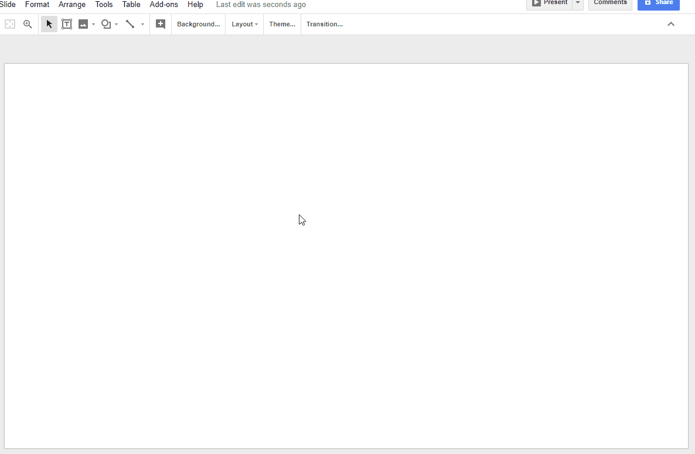

ShapeApp
=====

# Overview
This is an **add-on** application for manipulating shapes on Google Slide. It can create and update shapes by inputting parameters, and can arrange shapes. This is made of Google Apps Scripts (GAS).

# Demo

# Description
Have you ever thought about creating and updating shapes on Google Slides by inputting parameters, and arranging selected shapes? I have thought about them. Recently, since [Class SlidesApp](https://developers.google.com/apps-script/reference/slides/slides-app) was added to GAS, it came to be able to easily to create various applications for Slides. So I created this. This application is add-on application which was made of GAS. This application has the following functions.

1. **Create shapes**
    - Users can create shapes by inputting parameters which are Shape type, Width[pt], Height[pt], Rotation[degree], Position X [pt], Position Y [pt] and Production number.
1. **Retrieve a shape information**
    - Users can get the information (Object ID, Shape type, Width[pt], Height[pt], Rotation[degree], Position X [pt], Position Y [pt] and Production number) of the shape by selecting a shape.
1. **Update shapes**
    - This function is performed the same stage with "Retrieve a shape information".
    - Users can update the selected shape using retrieved parameters which are Width[pt], Height[pt], Rotation[degree], Position X [pt], Position Y [pt] and Production number.
1. **Arrange shapes**
    - Users can arrange selected shapes to lateral and vertical direction.
    - If "Open at edge" is selected, the shapes are not placed at both edges of the Slide. If "Close at edge" is selected, the shapes are also placed at both edges of the Slide.

# How to install
1. Create new spreadsheet.
1. Click "Add-ons" at menu bar.
1. Select "Get add-ons".
1. Input "ShapeApp" in "Search add-ons".
1. Install ShapeApp.

**Now this add-on was submitted to Google, when this is published, the URL of add-on will be displayed.**

# Usage
You can also see the usage from the above demonstration movie.

## Post-install tip
1. After installation, click Add-ons -> ShapeApp -> Launch ShapeApp
1. By this, add-on is launched at sidebar, users can see 3 buttons of "Create", "Update" and "Arrange".
1. When **"Create"** button is clicked, it's a mode for creating shapes. Users can create new shapes by inputting parameters which are Shape type, Width[pt], Height[pt], Rotation[degree], Position X [pt], Position Y [pt] and Production number and clicking "Create shape" button at the bottom. Production number means that the number of copies of the creating shape.
1. When **"Update"** button is clicked, it's a mode for updating shapes. At first, users select one shape from the Slide of left side and click "Select shape" button. By this, the information of selected shape is displayed to text boxes. Those are Object ID, Shape type, Width[pt], Height[pt], Rotation[degree], Position X [pt], Position Y [pt] and Production number. Only Object ID and Shape type cannot be modified. Users can modify each parameter except for Object ID and Shape type. When the modification is completed, users click "Update shape" button. By this, the shape is updated by the parameters. Reproduction number means that the number of copies of the selected shape.
1. When **"Arrange"** button is clicked, it's a mode for arranging shapes. At first, users select some shapes from the Slide of left side. The selected shapes can be arranged by clicking "Arrange shapes". Here, users can select the arrange type using selecting radio buttons. When "Arrange in lateral direction" and "Arrange in vertical direction" are selected, the selected shapes are arranged to the lateral and vertical direction, respectively. At that time, if "Open at edge" is selected, the shapes are not placed at both edges of the Slide. If "Close at edge" is selected, the shapes are also placed at both edges of the Slide. If the total length of selected shapes is larger than the page size of Slide, an error message is displayed by the pop-up dialog.

# Q&A
- [Difference Between Given Values and Retrieved Values for Shapes on Google Slides](https://gist.github.com/tanaikech/953e630855e65de55d8e5bd448ad764f)

-----

# [Privacy Policy](https://tanaikebox.github.io/2017/12/13/privacy-policy/)

# Licence
[MIT](LICENCE)

# Author
[Tanaike](https://tanaikech.github.io/about/)

If you have any questions and commissions for me, feel free to tell me.

# Update History
* v1.0.0 (January 3, 2018)

    1. Initial release.
        - It starts to wait for publishing this add-on.

[TOP](#TOP)
